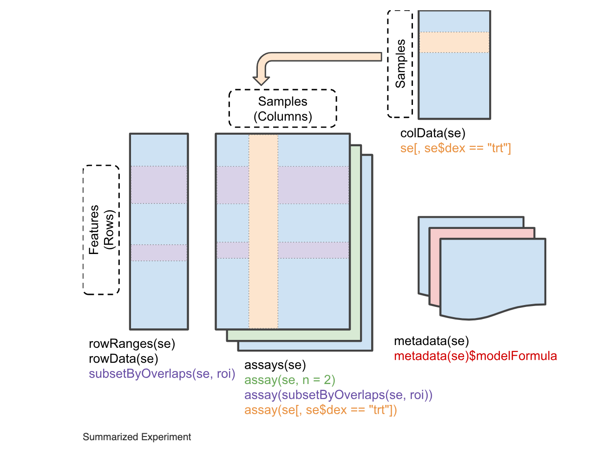

# **ABSTRACT O RESUMEN**

En esta PEC1 hemos llevado a cabo un análisis exploratorio de un dataset de metabolómica
que trata sobre "Metabotipos de respuesta a la cirugía bariátrica independientes de 
la magnitud de la pérdida de peso". Por lo tanto, hablamos de pacientes que se han sometido
a diferentes tipos de cirugía bariátrica y se ha medido diferentes tipos de metabolitos. 
El dataset contiene pues 39 muestras y 690 variables,  presentando gran porcentaje de 
valores faltantes (NA), concretamente 3390, que constituye un 12,6% del total de datos.
A partir de esta información, se incluyeron los datos de  expresión y los metadatos con 
información de las muestras en un objeto de clase *SummarizedExperiment*.

Posteriormente, se llevó a cabo primeramente un análisis estadístico univariante y
seguidamente unno multivariante, del que destacaremos el análisis de componentes principales 
(PCA) y el análisis de *clustering* jerárquico. Estos análisis nos mostraron la tendencia 
a la separación de las muestras en dos grupos, principalmente en función del tipo de cirugía. 
Esto sugiere que el tipo de cirugía podría influir de forma más significativa en el 
perfil metabólico de los pacientes intervenidos que el género.


# **OBJETIVOS** 

El objetivo principal de esta PEC1 es aplicar los conocimientos adquiridos durante
este primer reto de la asignatura "Análisis de datos ómicos", concretamente Bioconductor 
y la exploración multivariante de datos. Por lo tanto, en nuestro caso el objetivo
principal es crear un objeto de clase *SummarizedExperiment* para posteriormente
llevar a cabo un análisis exploratorio de este último con el fin de dentificar patrones 
biológicamente significativos.
Como objetivos más expecíficos podemos encontrar:

- La selección y preparación de los datos para su posterior integración en un *SummarizedExperiment*
y análisis con herramientas de Bioconductor.

- La realización un análisis exploratorio de los datos, identificando posibles valores faltantes
o atípicos.

- La reducción de la dimensionalidad del conjunto de datos utilizando el análisis de componentes 
principales (PCA) para facilitar la visualización e interpretación.

- La evaluación del agrupamiento en los datos mediante técnicas de "clustering" jerárquico.

- La interpretación final de los resultados obtenidos 

- Finalmente, la creación de un repositorio de GitHub que contenga toda la información
solicitada por el enunciado de la PEC1.


# **MÉTODOS**

Para este análisis se seleccionó un conjunto de datos de metabolómica obtenido del repositorio
facilitado por el enunciado de la PEC1. Dichos datos se descargaron en formato *.csv* 
y posteriormente se convirtieron en un objeto de clase SummarizedExperiment, utilizando 
el paquete de R *SummarizedExperiment()* del Bioconductor. 
Para el análisis exploratorio, concretamente el univariante, se calcularon estadísticas descriptivas
habituales, como la media o la desviación estándar, así como el porcentaje de valores NA, y se 
representaron con boxplot e histogramas, todo ello empleando funciones de R.
Del mismo modo se llevó a cabo el análisis multivariante; para el PCA se usó la
función de R *pca()* y posteriormente se empleó la función *biplot()* para graficar 
las PCA. Por último, se realizó el *clustering* jerárquico de los datos para seguidamente
visualizarlos en forma de dendograma, lo que permitió evaluar si las muestras se agrupan 
por el tipo de cirugía o por género.
Todo ello se llevó a cabo en un proyecto de RStudio bajo el control de versiones de Git,
y entre los paquetes empleados destacamos *BiocManager*, *SummarizedExperiment()*, *dplyr*,
*naniar* o *ggplot2*, entre otros.


# **ELABORACIÓN DE LA PEC1 Y RESULTADOS**

## Selección y descarga del dataset:

Del repositorio facilitado por el enunciado, del archivo *DataCatalog.xls*, elegimos el
primer dataset llamado *2018-MetabotypingPaper*, que cuenta con lo necesario: una matriz
de datos y los metadatos. Vemos que dicho dataset trata sobre metabolómica 
y dentro de su carpeta encontramos los archivos que necesitamos para trabajar: el archivo 
con los datos, llamado *DataValues_S013.csv*, y el archivo con los metadatos, *DataInfo_S013.csv*.

Descargamos ambos archivos usando el comando *read.csv()*.
```{r echo=FALSE}
Datos = read.csv("/Users/anarodriguez/Desktop/UOC/SEXTO SEMESTRE/ANÁLISIS DE DATOS ÓMICOS.2/PEC1/Rodriguez_Valido_Ana_Maria_PEC1/datos/DataValues_S013.csv")

Metadatos = read.csv("/Users/anarodriguez/Desktop/UOC/SEXTO SEMESTRE/ANÁLISIS DE DATOS ÓMICOS.2/PEC1/Rodriguez_Valido_Ana_Maria_PEC1/datos/DataInfo_S013.csv")

```

El dataset presenta 39 muestras y 696 variables (695 sin la columna *X.1*) y ambos
archivos son data.frames. El problema está en que el número de filas de los Metadatos
no coincide con el número de columnas de los Datos, y esto es debido a que en el archivo
de los Datos se incluye una columna llamada *X.1* cuyos datos se corresponden con la 
identificación de las muestras. Esta columna es redundante, ya que la columna siguiente
llamada *SUBJECTS* también contiene esa información, así que la podemos eliminar.

```{r}
# Eliminamos la columna llamada "X.1":
Datos$X.1 = NULL
```


## Creación de un objeto de clase *SummarizedExperiment*:

Buscando información en la página de Bioconductor sobre la estructura que debe tener
la clase *SummarizedExperiment*, tomo como referencia la siguiente imagen:

{ width=50% }

Por lo tanto, sabiendo gracias a la información facilitada por R usando *?SummarizedExperiment* 
que la función que crea el objeto de clase *SummarizedExperiment* es la siguiente: 

?SummarizedExperiment --> SummarizedExperiment(assays=SimpleList(), rowData=NULL, 
                          rowRanges=NULL, colData=DataFrame(), metadata=list(),
                          checkDimnames=TRUE)


Preparamos ahora cada una de las diferentes partes que lo componen.


### Preparación de las partes del *SummarizedExperiment*:

#### RowData:

Lo conforman los metadatos de las filas del *assay*, es decir, información sobre los 
metabolitos que facilita la identificación de muestras. En nuestro dataset esta información 
correspondiente a las filas se encuentra en las 5 primeras columnas del data.frame Datos,
pues estas contienen datos relacionados con los pacientes. Estos son los datos que
conforman el *rowData* y los separaremos del resto del archivo Datos:

```{r}
# Extraemos las columnas y las eliminamos del archivo "Datos":
row_data = Datos[ , c("SUBJECTS", "SURGERY", "AGE", "GENDER", "Group")]

Datos$SUBJECTS = NULL
Datos$SURGERY = NULL
Datos$AGE = NULL
Datos$GENDER = NULL
Datos$Group = NULL

```

Hacemos lo mismo para el archivo Metadatos para que así se cumpla que:
Número filas Metadatos = Número de columnas Datos:

```{r}
Metadatos = Metadatos[-c(1:5), ]
```

Sin embargo, observando más detenidamente los datos que hay en el data.frame Metadatos, 
veo que las columnas *X* y *VarName* son aparentemente iguales. Lo comprobamos y, 
si son iguales, eliminamos la columna *X* para así evitar tener datos por duplicado:

```{r}
identical(Metadatos$X, Metadatos$VarName)
```

Eliminamos pues la columna *X*:

```{r}
Metadatos$X = NULL
```

Comprobamos que el número filas Metadatos = número de columnas Datos para
continuar con el ejercicio:

```{r}
nrow(Metadatos) == ncol(Datos)
```

Continuamos con los datos de las muestras, *row_data*. Para poder crear el objeto de clase
*SummarizedExperiment*, se necesita que el objeto con la información de muestras tenga 
las columnas del data.frame en factores (las que no estén ya en ese formato) y también
que los nombres de las filas coincidan con los nombres de columnas de la 
matriz de expresión. Es importante tener en cuenta que el criterio que sigamos para
nombrar las filas debe respectar la no repetición, es decir, da error en cuanto dos
muestras tienen el mismo nombre. Por ello simplificaré el nombre a "Muestra_1", 
"Muestra_2", y así sucesivamente.

```{r message=FALSE, warning=FALSE}
# Convertimos las columnas del data.frame "row_data" en factores y le 
# ponemos nombres a las filas:

library(dplyr)

row_data = row_data %>%
  mutate(
    SURGERY = as.factor(SURGERY),
    GENDER  = as.factor(GENDER),
    Group   = as.factor(Group))

rownames(row_data) = paste0("Muestra_", seq_len(nrow(row_data)))

head(row_data)

```

#### Assays:

Aquí es donde guardaremos nuestra matriz de datos numéricos o matriz de expresión:
en la columnas estarán las muestras en cuestión y en las filas las características, 
que en nuestro caso son los metabolitos.
Concretamente, aquí es donde ubicaremos el archivo Datos. Tanto este archivo como
el de Metadatos están en forma de data.frame, pero para el objeto de clase *SummarizedExperiment*
es preciso que los Datos se encuentren en forma de matrices numéricas. Los Metadatos, 
en cambio, pueden seguir en forma de data.frame. Por lo tanto, convertimos el data.frame 
Datos en una matriz numérica y ponemos las filas de la misma forma que las filas de *row_data*:

```{r}
matriz_Datos = as.matrix(Datos)
rownames(matriz_Datos) = rownames(row_data)
```


#### colData:

Contiene información descriptiva de cada columna de la matriz de expresión,
es decir, contiene la información contenida en el archivo Metadatos.


#### Creamos el objeto de clase *SummarizedExperiment*:

Ya tenemos los parámetros necesarios:

- rawValues = La matriz de datos
- rowData = Los datos de las muestras, *row_data*
- colData = Los Metadatos

Para crear el objeto de clase *SummarizedExperiment* usaremos la función *SummarizedExperiment()*:

```{r echo=TRUE, message=FALSE, warning=FALSE}
library(SummarizedExperiment)
Sum_Exp = SummarizedExperiment(assays = list(rawValues = matriz_Datos), rowData = row_data,
    colData = Metadatos)
(Sum_Exp)

```

```{r include=FALSE}
# Lo guardamos en formato binario para más adelante:
save(Sum_Exp, file = "../Objeto/Objeto_Sum_Exp.Rda")

```

### ¿Cuáles son las principales diferencias de la clase *SummarizedExperiment* con la clase *ExpressionSet*?

Atendiendo a la información facilitada por RStudio empleando las funciones: *?SummarizedExperiment* y
*?ExpressionSet*, concluimos las siguientes diferencias en esta tabla:


| Característica                     | SummarizedExperiment                         | ExpressionSet                        |
|-----------------------------------|----------------------------------------------|---------------------------------------|
| Estructura                        | Flexible, moderna (basada en S4Vectors)      | Meno flexible. Proviene de eSet       |
| Paquete                           | SummarizedExperiment (moderno)               | Biobase (clásico)                     |
| Datos matriz de expresión         | Uno o varios assays                          | Solo una única matriz de expresión    |
| Información sobre las caracteríticas que se miden | rowData (DataFrame)           | featureData (AnnotatedDataFrame)     |
| Información sobre las muestras    | colData (DataFrame)                          | phenoData (AnnotatedDataFrame)        |
| Datos sobre el experimento        | metadata                                     | experimentData (objeto MIAME)         |


En definitiva, el objeto de clase *SummarizedExperiment* es el más moderno y el más usado
actualmente, y es el que más compatibilidad presenta con los nuevos paquetes disponibles.


## Análisis exploratorio de los datos:

### Análisis estadístico univariante:

```{r}
dim(Datos)
# 39 filas de muestras y 690 variables que son los metabolitos.

library(SummarizedExperiment)

# Calculamos los estadísticos habituales por fila:

media =rowMeans(Datos, na.rm = TRUE)
sd = apply(Datos, 1, sd, na.rm = TRUE)
coef_variacion = sd / media

```

Ver resumen estadístico en **Anexo 1**.

Hallamos ahora la distancia euclídea entre muestras:
```{r}
# La función "dist()" calcula distancias por filas, así que las transponemos:
dist_muestras = dist(t(assay(Sum_Exp)), method = "euclidean")
head(dist_muestras)
```

Una opción mejor son los boxplots, pues permiten ver la distribución de los metabolitos por muestra 
(Ver gráfico en el **Anexo 2**). Otra opción es emplear un histrograma (Ver **Anexo 3**).

Como resumen:

```{r}

resumen_final = function(Sum_Exp) {
  cat("Dimensiones: ", dim(Sum_Exp), "\n")
  cat("Assays: ", assayNames(Sum_Exp), "\n")
  cat("Genes/metabolitos: ", nrow(Sum_Exp), "\n")
  cat("Muestras: ", ncol(Sum_Exp), "\n")
  cat("Valores NA: ", sum(is.na(assay(Sum_Exp))), "\n")
  cat("Variables en colData: ", colnames(colData(Sum_Exp)), "\n")
}
resumen_final(Sum_Exp)
```
### Análisis estadístico multivariante:

Para llevar a cabo este análisis, tendremos como referencia los apuntes de la actividad
1.3. del aula, concretamente el archivo pdf llamado "Exploración multivariante de datos ómicos".


#### Valores perdidos o faltantes (NA):

Comenzaremos estudiando si de entre la gran cantidad de datos que disponemos
encontramos valores faltantes, NA:

```{r}
sum(is.na(assay(Sum_Exp)))

# Hallamos su valor en porcentaje:

sum(is.na(assay(Sum_Exp))) / length(assay(Sum_Exp)) * 100

```

Observamos que tenemos 3390 datos NA, lo que representa un 12,6% del total de los datos. 
Ahora vamos a estudiar más en profundidad estos datos usando el paquete *naniar*. Este 
permite, entre otras cosas, visualizar qué variables tienen más NA y hacer gráficos con 
ellos (ver gráfico en **Anexo 4**).

```{r}
library(naniar)

# Transformamos en data.frame la matriz de expresión contenida en "assay" para poder
# trabajar con el paquete "naniar":

assay_df =  as.data.frame(t(assay(Sum_Exp, "rawValues")))

# Empleando la función "miss_var_summary", visualizamos cuántos valores faltan por 
# columna (variable/metabolito), pues esta función que calcula el número y el porcentaje 
# de valores NA por variable que conforma cada una de las columnas:

library(naniar)
library(ggplot2)

NA_summary = miss_var_summary(assay_df)

```


El gráfico muestra que varias muestras contienen un gran porcentaje de valores NA.
¿Y qué hacemos con estos valores NA? Les asignaremos un valor, concretamente 0, que
nos indica pues que en esa casilla falta un dato, es decir, que no se detectó la
concentración de ese metabolito en cuestión.

```{r}
# Extremos de nuevo la matriz de expresión pero esta vez no hace falta transformarla
# en un data.frame:
assay = assay(Sum_Exp, "rawValues")

# Creamos un nuevo conjunto de datos:
assay_NA = assay

# Reemplazamos los valores de NA por 0:
assay_NA[is.na(assay_NA)] = 0

```


#### Análisis de componentes principales (PCA):

El PCA se suele emplear para el análisis exploratorio multivariado pues muy útil para 
reducir la dimensión de los datos facilitando así su visualización. En R existen 
múltiples paquetes que permiten realizar PCA de forma sencilla, siendo una opción 
interesante el paquete *PCAtools*, disponible en Bioconductor. Sin embargo, este paquete 
no trabaja directamente con objetos de tipo *SummarizedExperiment*, sino que requiere 
una matriz o data.frame numérico para los datos y para los metadatos.
Asimismo, para poder realizar este análisis, necesitamos que no hayan datos NA, por 
lo que usamos el *assay* creado anteriormente que carece de NA. Para esto, primeramente 
debemos añadir la nueva matriz de datos sin NA al objeto *Sum_Exp*:
```{r}
assays(Sum_Exp)$rawValues_sin_NA = assay_NA
Sum_Exp
assayNames(Sum_Exp)

```
Vemos que nuestro *SummarizedExperiment* cuenta con las dos matrices de datos.

```{r message=FALSE, warning=FALSE}
library(PCAtools)

# Para el PCA debemos transponer la matriz, de tal manera que las filas pasan a ser columnas
# y las columnas pasan a ser filas

data = t(assay(Sum_Exp, "rawValues_sin_NA"))

# Con la función "pca" procedemos al análisis:

PCA = pca(data, metadata = rowData(Sum_Exp), removeVar = 0.1)

```

Para visualizar nuestras componentes principales, lo primero que hacemos es usar 
la función *screeplot* para ver cuánto aporta cada componente principal y, a partir 
de ahí sacar los diferentes gráficos con la función *biplot*. El gráfico muestra 
el porcentaje de variación frente a las componentes principales (ver **Anexo 5**).

Vemos que las 4 primeras componentes son suficientes para realizar el análisis, pero
sobre todo las 3 primeras:

- Las componentes 1 y 2 (PC1 y PC2) explican una gran parte de la variabilidad, 
probablemente más del 50% entre las dos.

- Las componentes 3 y 4 (PC3 y PC4) explican menos variabilidad pero todavía aportan algo útil.

Para visualizar nuestras componentes principales emplearemos la función *biplot()*,
que crea un gráfico que permite visualizar las muestras o bien las muestras y las 
variables cuyos valores están más relacionados con las componentes. Por defecto, 
*biplot()* muestra PC1-PC2, pero nosotros también estudiaremos otras combinaciones,
concretamente: PC1-PC3 y PC2-PC3.
Probaremos diferentes variables para ver cuál separa mejor los grupos en el PCA.
Concretamente probaremos por género ("GENDER") y por tipo de cirugía ("SURGERY").
Ver **Anexo 6** para el análisis PC1-PC2, PC1-PC3 y PC2-PC3 para la variable "GENDER".

Cambiamos ahora de variable para separar los grupos en el PCA: por tipo de cirugía ("SURGERY").
Ver **Anexo 7** para el análisis PC1-PC2, PC1-PC3 y PC2-PC3 para la variable "SURGERY".


**Conclusión general sobre el PCA:** 

- En cuanto a la variable "GENDER", esta no parece ser un factor que influya en gran 
medida en las principales fuentes de variación en estos datos. Vimos que en el mejor 
de los casos con PC1-PC3 hay una leve de separación, pero no es suficiente como para concluir 
que la variable "GENDER" separa bien los grupos en el PCA.

- La variable "SURGERY", sin embargo, parece  tener bastante que ver con cómo varían 
los datos, sobre todo en la primera componente principal (PC1), que es la que más información
explica (35.19%). Separa por tanto bastante bien los grupos, obervándose en el gráfico PC1-PC2 
una separación bastante clara entre los grupos "by pass" y "tubular".


#### *Clustering* jerárquico:

Para finalizar este análisis multivariante, realizaremos un *clustering* jerárquico 
y posteriormente lo visualizaremos en un dendrograma (ver **Anexo 8**).


Viendo a qué grupos pertenecen cada muestra, vemos que las muestras de color verde
se agrupan fundamentalmente por el tipo de cirugía "by pass" y las de color rosa
por el tipo de cirugía "tubular". En cuanto al género, se reparte entre ambos grupos
de color sin seguir un patrón concreto.


# DISCUSIÓN

Con este trabajo, se ha podido ver la gran importancia que tiene el análisis exploratorio
de los datos, especialmente el análisis multivariante debido a que nos permite trabajar 
con múltiples variables a la vez y, además, ayuda a reducir la dimensionalidad de 
los datos sin perder mucha información. Es decir, con el análisis multivatiante
podemos llevar a cabo un analisis de los datos más exhautivo, sacando así mejores conclusiones. 
Por otro lado, la principal limitación con la que me he encontrado ha sido la gran cantidad
de valores faltantes, lo que dificulta el análisis exacto de los datos así como
el uso de funciones de R más sofisticadas. 
Sin embargo, a pesar de las limitaciones, hemos podido diferenciar una clara separación
por grupos, concretamente por el tipo de cirugía llevada a cabo. Esto sugiere que,
probablemente, las diferentes concentraciones de los metabolitos se encuentran influenciadas
por el tipo de cirugía aplicada.


# CONCLUSIONES

Tras organizar el conjunto de datos metabolómicos en un objeto de clase *SummarizedExperiment*,
el análisis exploratorio permitió detectar problemas de calidad de los datos, destacándose
la gran cantidad de valores NA. 
El PCA mostró una agrupación de los datos más clara por tipo de cirugía que por género,
lo cual quedó reforzado tras realizar el análisis de *clustering* jerárquico y el
dendograma. Por lo tanto, podemos concluir que el tipo de cirugía llevada a cabo 
tiene un efecto más significativo en el perfil metabólico de los pacientes intervenidos
que el género.
Todo este análisis está versionado con Git y está disponible públicamente en el repositorio
de Github llamado: **Rodriguez-Valido-Ana-Maria-PEC1**.


# REFERENCIAS

Para la resolución de esta PEC1 he empleado el material proporcionado en el aula para 
el Reto 1, destacando el pdf "Exploración multivariante de datos ómicos" y los enlaces: 
"Casos y Ejemplos Resueltos de Análisis Multivariante" y "Exploración "naive" de datos 
de microarrays con R". De igual forma, Bioconductor también ha sido de gran ayuda ya que en él he podido
encontrar información acerca de qué es y cómo se estructura un *SummarizedExperiment*:
**[Enlace](https://www.bioconductor.org/packages/release/bioc/vignettes/SummarizedExperiment/inst/doc/SummarizedExperiment.html#assays)**. El enlace al repositorio de GitHub con el código que he utilizado para abordar el análisis
es: **[Enlace_repositorio](https://github.com/Ana-UOCstudy/Rodriguez-Valido-Ana-Maria-PEC1)**


# ANEXOS

## Anexo 1

```{r}
resumen = data.frame(
  media = media,
  sd = sd,
  cv = coef_variacion)

resumen
```


## Anexo 2

```{r}
boxplot(assay(Sum_Exp), main = "Distribución por muestra", ylab = "Muestras", 
        las = 2, cex.axis = 0.5)
```

## Anexo 3

```{r}
hist(assay(Sum_Exp), 
     main = "Distribución valores numéricos", 
     col = "lightblue", breaks = 100)
```

## Anexo 4

```{r}
ggplot(NA_summary, aes(x = reorder(variable, n_miss), y = n_miss)) +
  geom_bar(stat = "identity", fill = "steelblue") +
  coord_flip() +
  labs(title = "Valores NA por variable", x = "Variable", y = "Cantidad de NA")
```

## Anexo 5

```{r message=FALSE, warning=FALSE}
screeplot(PCA, axisLabSize = 8, titleLabSize = 15)
```

## Anexo 6

```{r message=FALSE, warning=FALSE}
biplot(PCA, x = "PC1", y = "PC2", showLoadings = FALSE, labSize = 2, pointSize = 2,
       axisLabSize = 7, title = "PCA por género PC1 y PC2", colby = "GENDER",
       hline = 0, vline = 0, legendPosition = "bottom")

grafico_PCA = biplot(PCA, x = "PC1", y = "PC2", showLoadings = FALSE, labSize = 2, pointSize = 2,
       axisLabSize = 7, ellipse = TRUE, title = "PCA por género PC1 y PC2", colby = "GENDER",
       hline = 0, vline = 0, legendPosition = "bottom")

# Ajustamos las dimensiones de los ejes para ver mejor el gráfico:
grafico_PCA + coord_fixed() + xlim(-4000, 4000) + ylim(-2000, 2000)
```

Analizando el gráfico vemos que los puntos están coloreados según género (femenino, F, en rojo, 
masculino, M, en turquesa) y que las muestras de ambos géneros están muy agrupadas 
y mezcladas, lo que hace que no haya una clara división a lo largo de PC1 ni PC2.
Por lo tanto, podemos concluir que la información de género no explica la variabilidad 
en las primeros componentes. Probaremos con las componente PC1 - PC3, y PC2 - PC3: 
       
```{r message=FALSE, warning=FALSE}
grafico_PCA_2 = biplot(PCA, x = "PC1", y = "PC3", showLoadings = FALSE, labSize = 2, pointSize = 2,
       axisLabSize = 7, ellipse = TRUE, title = "PCA por género PC1 y PC3", colby = "GENDER",
       hline = 0, vline = 0, legendPosition = "bottom")

# Ajustamos las dimensiones de los ejes para ver mejor el gráfico:
grafico_PCA_2 + coord_fixed() + xlim(-4000, 4000) + ylim(-2000, 2000)
```

En comparación con el anterior gráfico, vemos que se observa una ligera separación
entre los géneros (F y M), aunque sigue habiendo bastante solapamiento.

```{r message=FALSE, warning=FALSE}
grafico_PCA_3 = biplot(PCA, x = "PC2", y = "PC3", showLoadings = FALSE, labSize = 2, pointSize = 2,
       axisLabSize = 7, ellipse = TRUE, title = "PCA por género PC2 y PC3", colby = "GENDER",
       hline = 0, vline = 0, legendPosition = "bottom")

# Ajustamos las dimensiones de los ejes para ver mejor el gráfico:
grafico_PCA_3 + coord_fixed() + xlim(-4000, 4000) + ylim(-2000, 2000)
```

Este gráfico, sin embargo, es bastante peor que los dos anteriores porque, por un lado,
en conjunto las componentes 2 y 3 explican menos variación que la PC1, y por otro lado, 
hay menos separación entre los grupos, superponiéndose casi totalmente las elipses.

## Anexo 7

```{r message=FALSE, warning=FALSE}
biplot(PCA, x = "PC1", y = "PC2", showLoadings = FALSE, labSize = 2, pointSize = 2,
       axisLabSize = 7, title = "PCA por tipo de cirugía PC1 y PC2", colby = "SURGERY",
       hline = 0, vline = 0, legendPosition = "bottom")

grafico_PCA_4 = biplot(PCA, x = "PC1", y = "PC2", showLoadings = FALSE, labSize = 2, pointSize = 2,
       axisLabSize = 7, ellipse = TRUE, title = "PCA por tipo de cirugía PC1 y PC2", colby = "SURGERY",
       hline = 0, vline = 0, legendPosition = "bottom")

# Ajustamos las dimensiones de los ejes para ver mejor el gráfico:
grafico_PCA_4 + coord_fixed() + xlim(-4000, 4000) + ylim(-2000, 2000)
```

Empleando la variable "SURGERY" vemos que ahora hay una separación más clara entre 
los dos grupos (cirugía "by pass" y cirugía "tubular"), lo que hace que las elipses 
estén separadas y que apenas se solapen.

Analizamos ahora PC1-PC3 y PC2-PC3 como hicimos para la variable "GENDER":

```{r message=FALSE, warning=FALSE}
grafico_PCA_5 = biplot(PCA, x = "PC1", y = "PC3", showLoadings = FALSE, labSize = 2, pointSize = 2,
       axisLabSize = 7, ellipse = TRUE, title = "PCA por tipo de cirugía PC1 y PC3", colby = "SURGERY",
       hline = 0, vline = 0, legendPosition = "bottom")

# Ajustamos las dimensiones de los ejes para ver mejor el gráfico:
grafico_PCA_5 + coord_fixed() + xlim(-4000, 4000) + ylim(-2000, 2000)
```


Para PC1-PC3 se observa también una separación a lo largo del eje X (PC1), pero menos 
marcada que en el gráfico PC1-PC2, motivo por el cual las elipses tienen cierto solapamiento.


```{r message=FALSE, warning=FALSE}
grafico_PCA_6 = biplot(PCA, x = "PC2", y = "PC3", showLoadings = FALSE, labSize = 2, pointSize = 2,
       axisLabSize = 7, ellipse = TRUE, title = "PCA por tipo de cirugía PC2 y PC3", colby = "SURGERY",
       hline = 0, vline = 0, legendPosition = "bottom")

# Ajustamos las dimensiones de los ejes para ver mejor el gráfico:
grafico_PCA_6 + coord_fixed() + xlim(-4000, 4000) + ylim(-2000, 2000)
```

Para este gráfico PC2-PC3 las muestras están muy mezcladas y no hay una sepación clara,
motivo por el que las elipses de los dos grupos se solapan mucho.

## Anexo 8

```{r message=FALSE, warning=FALSE}
library(factoextra)

# Obtenemos el clustering jerárquico:
datos_clustering = scale(assay(Sum_Exp, "rawValues_sin_NA"))
clustering = hclust(dist(datos_clustering), method = "ward.D2")

# Dibujar el dendrograma
fviz_dend(clustering, cex = 0.6, k = 2, k_colors = c("pink", "forestgreen"), rect = TRUE)

```

